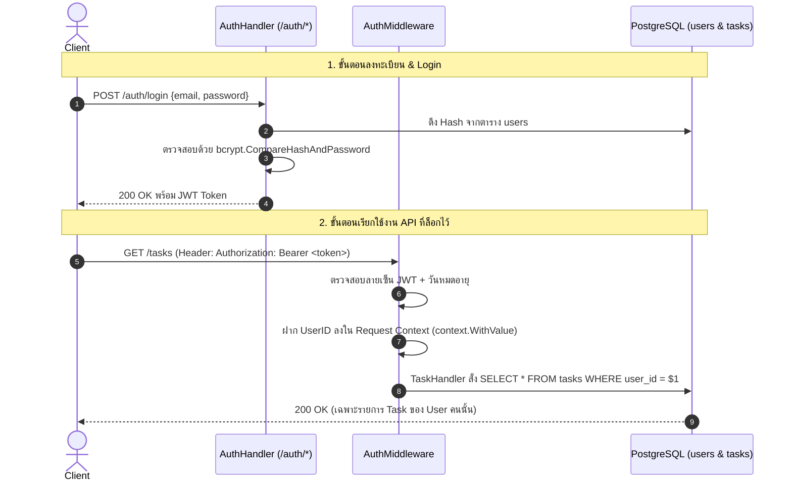
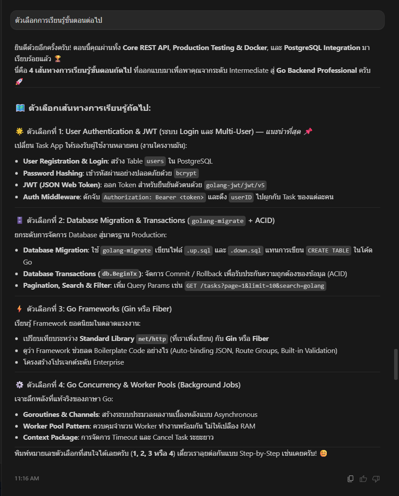
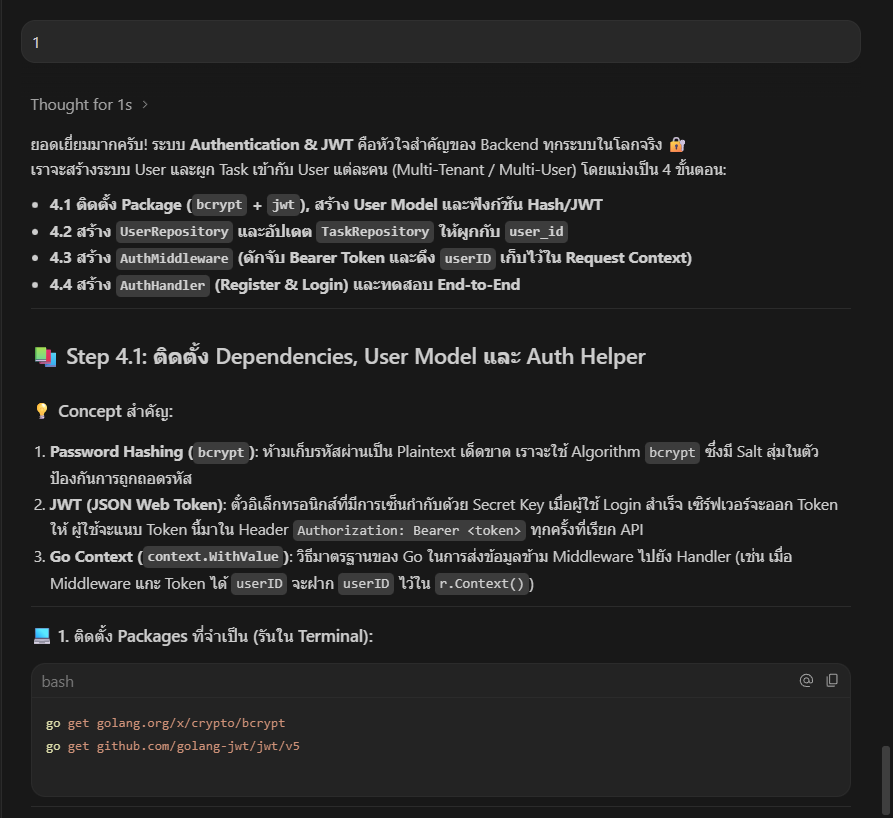
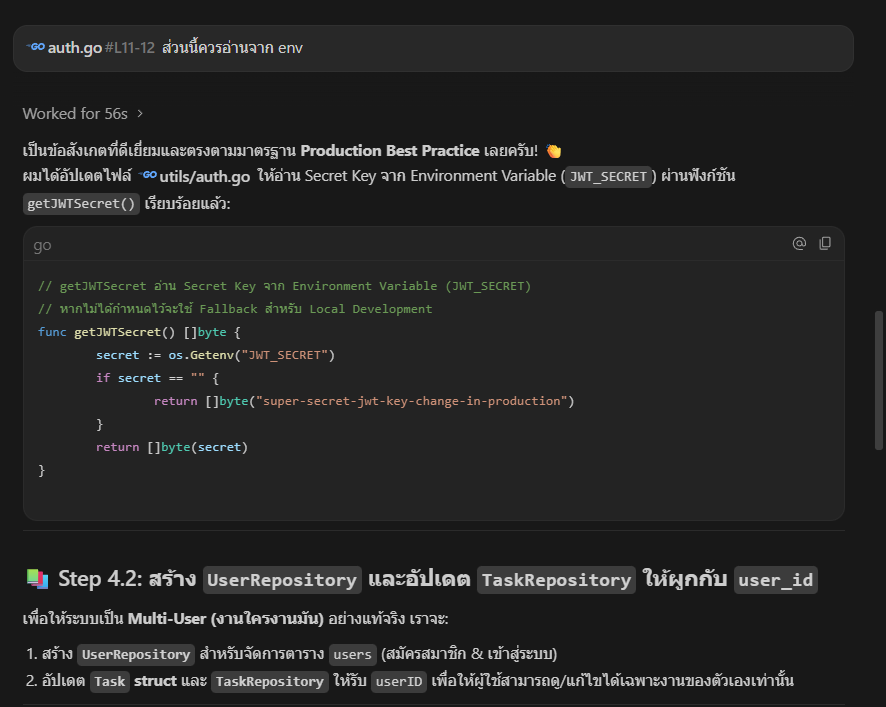
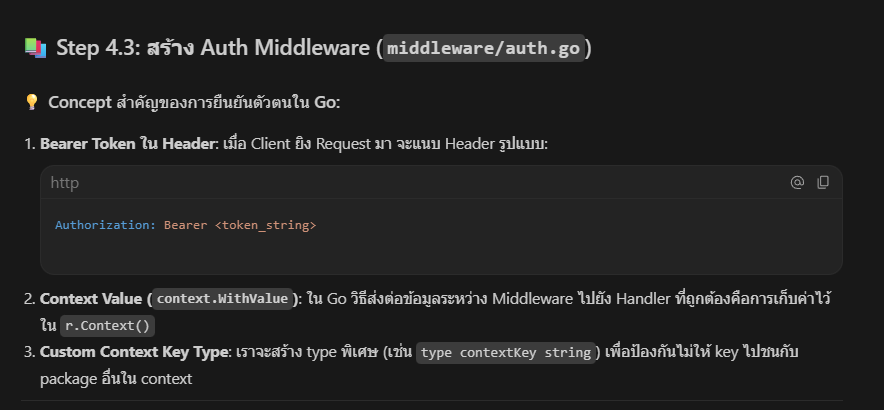
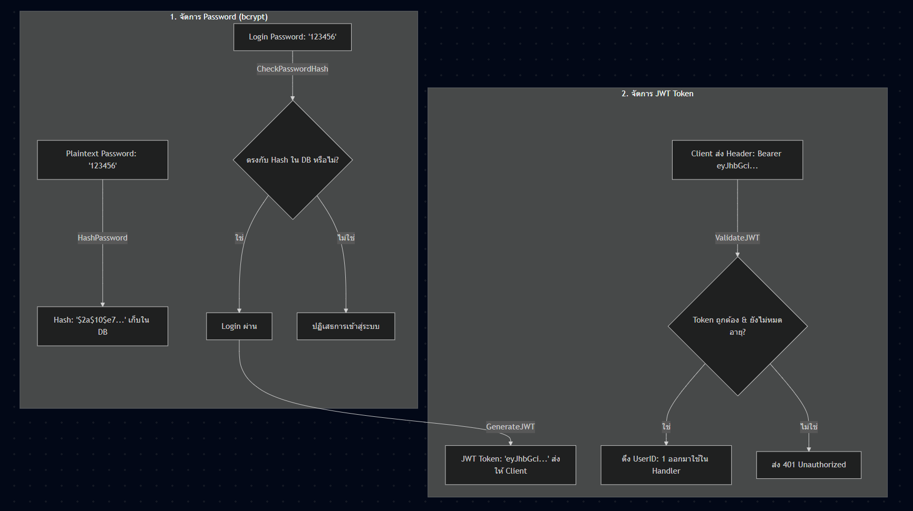
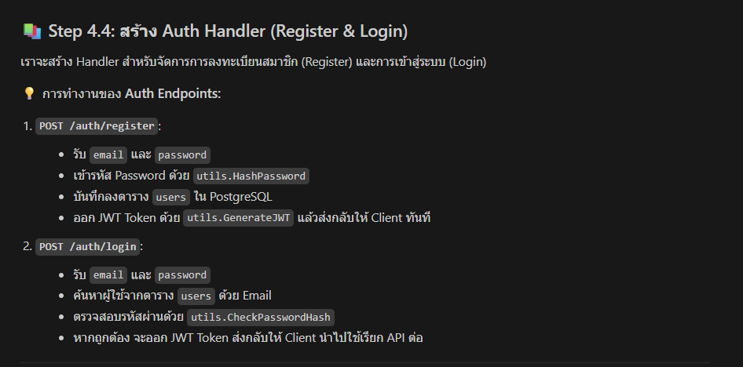
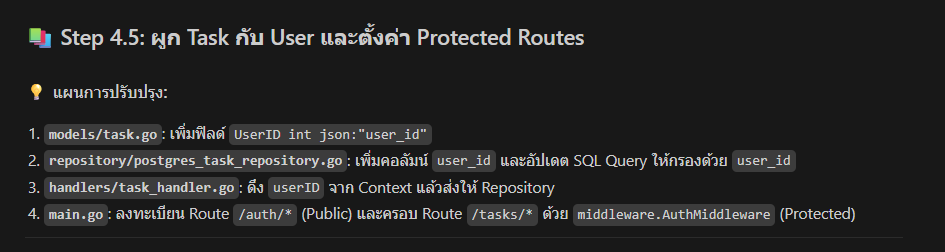
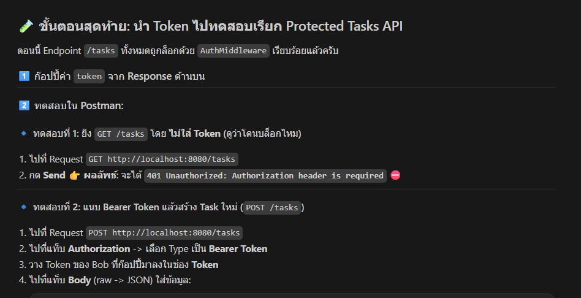
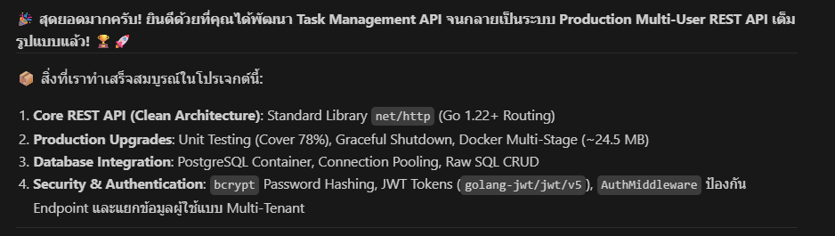

# Walkthrough 4: User Authentication & JWT Security (Multi-User Architecture)

ในส่วนนี้เป็นการยกระดับ **Task Management REST API** ให้กลายเป็นระบบ **Multi-User (งานใครงานมัน)** อย่างสมบูรณ์แบบ โดยเพิ่มระบบสมัครสมาชิก, เข้าสู่ระบบ, การเข้ารหัสผ่านด้วย `bcrypt`, และการรักษาความปลอดภัยด้วย **JWT (JSON Web Token)** 🔐🚀

---

## 🏗️ โครงสร้างสถาปัตยกรรมระบบ Authentication

```
1_task-app/
├── models/
│   ├── user.go                # [NEW] Data Models สำหรับ User & Auth DTOs
│   └── task.go                # [UPDATE] เพิ่มฟิลด์ user_id
├── utils/
│   └── auth.go                # [NEW] Bcrypt Hashing & JWT Token Helper
├── repository/
│   ├── user_repository.go     # [NEW] Interface & PostgreSQL User Storage
│   └── postgres_task_repository.go # [UPDATE] รองรับการกรอง Task ตาม user_id
├── middleware/
│   └── auth.go                # [NEW] AuthMiddleware & Context Value Injection
├── handlers/
│   ├── auth_handler.go        # [NEW] Register & Login Handlers
│   └── task_handler.go        # [UPDATE] ดึง UserID จาก Context มาทำ CRUD
└── main.go                    # [UPDATE] แยก Public Routes และ Protected Routes
```

---

## 🔐 4.1 ลำดับการทำงานของระบบความปลอดภัย



---

## 🔑 4.2 ฟีเจอร์ความปลอดภัยที่พัฒนาขึ้น

### 1. Password Hashing (`bcrypt`)
- เข้ารหัสผ่านแบบ One-way ด้วย `golang.org/x/crypto/bcrypt` พร้อม Random Salt
- ไม่มีการเก็บรหัสผ่าน Plaintext ในฐานข้อมูลเด็ดขาด
- ซ่อน Password ไม่ให้แสดงออกไปใน JSON ด้วย Struct Tag `json:"-"`

### 2. JWT (JSON Web Token)
- ออก Token พร้อม Payload `user_id` และ `email` โดยมีอายุ 24 ชั่วโมง
- อ่าน Secret Key จาก Environment Variable (`JWT_SECRET`) พร้อม Fallback สำหรับ Development

### 3. Auth Middleware & Request Context
- ดักจับ Header `Authorization: Bearer <token>`
- ใช้ `context.WithValue` ฝาก `userID` ไว้ใน Request เพื่อให้ Handler ดึงไปใช้ด้วย `GetUserIDFromContext`

### 4. Multi-Tenant Data Isolation
- คำสั่ง SQL CRUD ทั้งหมดถูกผูกกับ `user_id`:
  - `SELECT * FROM tasks WHERE user_id = $1`
  - `INSERT INTO tasks (title, description, user_id) VALUES ($1, $2, $3)`
  - `UPDATE tasks ... WHERE id = $4 AND user_id = $5`
  - `DELETE FROM tasks WHERE id = $1 AND user_id = $2`

---

## 🧪 4.3 ผลการทดสอบ (Verification Results)

### 1. สมัครสมาชิก (POST /auth/register)
ส่ง Email และ Password เพื่อสร้าง User ใหม่ในตาราง `users` และรับ JWT Token:


### 2. เข้าสู่ระบบ (POST /auth/login)
ตรวจสอบรหัสผ่านและรับ JWT Token พร้อมข้อมูล User:


### 3. ทดสอบเรียก Protected Route โดยไม่มี Token (GET /tasks)
ระบบจะตอบกลับ `401 Unauthorized` ทันที:


### 4. ตั้งค่า Dynamic Token ใน Postman
เซฟ Token เข้า Collection Variable อัตโนมัติด้วย Post-response script:


### 5. ดึงรายการ Task ด้วย Bearer Token (GET /tasks)
ดึงเฉพาะงานของ User ตัวเองสำเร็จ:


### 6. สร้าง Task ใหม่ (POST /tasks)
สร้างงานพร้อมผูก `user_id` อัตโนมัติ:


### 7. อัปเดต Task (PUT /tasks/:id)
แก้ไขชื่องานและรายละเอียดงานของตัวเอง:


### 8. ลบ Task (DELETE /tasks/:id)
ลบงานตาม ID เฉพาะของตัวเอง:


### 9. บันทึกการทำงานของ Server (Logging Middleware)
Server บันทึก Latency และ Status Code ของทุก Request อย่างถูกต้อง:


---

## 🧠 สรุป Concept สำคัญของ Section นี้

| หัวข้อ | Concept สำคัญในภาษา Go |
| :--- | :--- |
| **One-Way Hashing** | การใช้ `bcrypt.GenerateFromPassword` และ `bcrypt.CompareHashAndPassword` |
| **JWT Claims** | การใช้ `jwt.RegisteredClaims` ร่วมกับ Custom Struct และการ Parse Token |
| **Go Context Pipeline** | การใช้ `context.WithValue` และ Custom Context Key Type ส่งข้อมูลข้าม Middleware |
| **Postman Automation** | การใช้ Post-response Script เซฟ Dynamic Token เข้า Collection Variable |
| **Multi-User Isolation** | การออกแบบ Database Schema และ SQL Filtering ระดับแถวข้อมูล (Row-level Security) |
