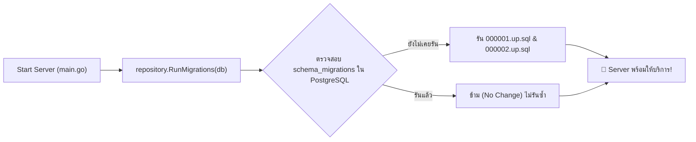
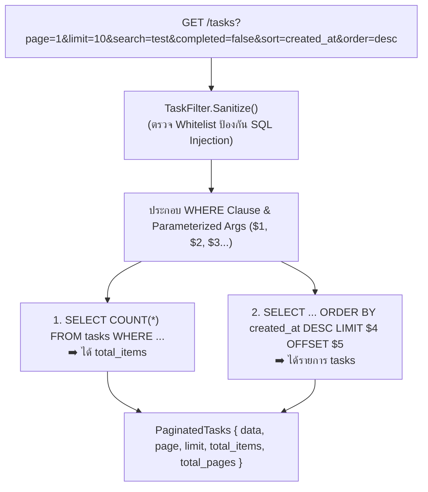

# Walkthrough 5: Database Migrations, Pagination, Search & Sorting

ในส่วนนี้เป็นการยกระดับ **Task Management REST API** สู่มาตรฐานระดับ **Enterprise-Grade** โดยเปลี่ยนจากการเขียนคำสั่ง DDL ในโค้ด Go มาใช้เครื่องมือ **`golang-migrate`** พร้อมทั้งสร้าง **Dynamic SQL Query Builder** สำหรับรองรับการค้นหา (Search), การกรอง (Filter), การเรียงลำดับ (Sorting), และการแบ่งหน้า (Pagination) 🗄️⚡

---

## 🏗️ โครงสร้างไฟล์ที่พัฒนาในส่วนนี้

```
1_task-app/
├── migrations/
│   ├── 000001_create_users_table.up.sql    # [NEW] สคริปต์สร้างตาราง users
│   ├── 000001_create_users_table.down.sql  # [NEW] สคริปต์ Rollback ตาราง users
│   ├── 000002_create_tasks_table.up.sql    # [NEW] สคริปต์สร้างตาราง tasks & Indexes
│   └── 000002_create_tasks_table.down.sql  # [NEW] สคริปต์ Rollback ตาราง tasks
├── models/
│   └── pagination.go                       # [NEW] TaskFilter DTO & PaginatedTasks Response
├── repository/
│   ├── migrations.go                       # [NEW] ฟังก์ชัน RunMigrations ด้วย golang-migrate
│   ├── task_repository.go                  # [UPDATE] รองรับ TaskFilter ใน Interface
│   └── postgres_task_repository.go         # [UPDATE] Dynamic SQL Query Builder & Indexes
├── handlers/
│   └── task_handler.go                     # [UPDATE] อ่าน Query Params และส่ง Paginated Response
└── main.go                                 # [UPDATE] เรียก RunMigrations อัตโนมัติก่อนเริ่มเซิร์ฟเวอร์
```

---

## 🔍 5.1 ระบบ Database Migration (`golang-migrate`)



### จุดเด่น:
- **Version Control สำหรับ Database**: ควบคุมการเปลี่ยนแปลง Schema อย่างเป็นระบบ
- **High-Performance Indexes**: สร้าง B-Tree Index บนคอลัมน์ `user_id` และ `completed` เพื่อให้การค้นหาเร็วกว่าเดิมในระดับ $O(\log N)$

---

## ⚡ 5.2 สถาปัตยกรรม Dynamic SQL Query Builder



---

## 🧪 5.3 ผลการทดสอบ (Verification Results)

### ตัวอย่าง Request แบบ Combined Query (Search + Filter + Sort + Pagination):
- **URL**: `GET http://localhost:8080/tasks?page=1&limit=10&search=test&completed=false&sort=created_at&order=desc`
- **Response**: **`200 OK` (Latency: 4 ms)** 🚀

```json
{
  "data": [
    {
      "id": 8,
      "title": "test 4",
      "description": "desc 4",
      "completed": false,
      "user_id": 1,
      "created_at": "2026-08-16T07:33:02.594193Z"
    },
    {
      "id": 7,
      "title": "test 3",
      "description": "desc 3",
      "completed": false,
      "user_id": 1,
      "created_at": "2026-08-16T07:32:57.297701Z"
    },
    {
      "id": 6,
      "title": "test 2",
      "description": "desc 2",
      "completed": false,
      "user_id": 1,
      "created_at": "2026-08-16T07:32:51.88679Z"
    },
    {
      "id": 5,
      "title": "test 1",
      "description": "desc 1",
      "completed": false,
      "user_id": 1,
      "created_at": "2026-08-16T07:32:48.15393Z"
    }
  ],
  "page": 1,
  "limit": 10,
  "total_items": 4,
  "total_pages": 1
}
```

---

## 🧠 สรุป Concept สำคัญของ Section นี้

| หัวข้อ | Concept ในภาษา Go & Database |
| :--- | :--- |
| **Schema Migrations** | การใช้ `golang-migrate` รันไฟล์ `.up.sql` และ `.down.sql` อัตโนมัติ |
| **SQL Whitelist Validation** | การป้องกัน SQL Injection ใน `ORDER BY` ด้วย Go Map Whitelist |
| **Dynamic Parameterized Query** | การสร้าง `$1, $2, $3` และส่ง `args...` ตามฟิลด์ที่ส่งเข้ามาจริง |
| **Case-Insensitive Search** | การใช้ `ILIKE` ใน PostgreSQL เพื่อค้นหาข้อความแบบไม่สนใจตัวพิมพ์เล็ก-ใหญ่ |
| **Pagination Formula** | การคำนวณ `OFFSET = (page - 1) * limit` และ `totalPages = ceil(total / limit)` |
