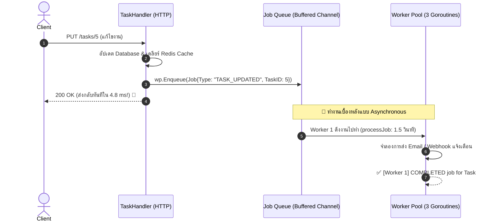

# Walkthrough 7: Go Concurrency & Background Worker Pools

ในส่วนนี้เป็นการนำหัวใจสำคัญอันดับหนึ่งของภาษา Go นั่นคือ **Concurrency (Goroutines, Channels & Worker Pool Pattern)** มาประยุกต์ใช้เพื่อสร้างระบบ **Asynchronous Background Job Queue** สำหรับประมวลผลงานหนักเบื้องหลัง (เช่น ส่ง Email / Webhook Notification) โดยไม่บล็อกการตอบกลับของ HTTP Response ⚡👷

---

## 🏗️ โครงสร้างไฟล์ที่พัฒนาในส่วนนี้

```
1_task-app/
├── workers/
│   └── worker_pool.go         # [NEW] Worker Pool Manager (Buffered Channel & Graceful Shutdown)
├── handlers/
│   ├── task_handler.go        # [UPDATE] ส่ง Job เข้า Worker Pool เมื่อ Create/Update/Delete
│   └── task_handler_test.go   # [UPDATE] อัปเดต Unit Tests ให้รองรับ WorkerPool
├── main.go                    # [UPDATE] กำหนดจำนวน Workers (3 workers) และ Graceful Shutdown
└── README.md                  # [UPDATE] เอกสารประกอบโปรเจกต์ฉบับสมบูรณ์
```

---

## 🔍 7.1 สถาปัตยกรรม Worker Pool Pattern



---

## ⚡ 7.2 จุดเด่นด้าน Concurrency & Reliability

### 1. ป้องกัน Resource Exhaustion (จำกัดจำนวน Goroutines)
- ไม่ใช้ `go func()` สุ่มสี่สุ่มห้า เพราะหากมี 50,000 requests เข้ามาพร้อมกัน RAM จะเต็มทันที
- ใช้ **Worker Pool** กำหนดจำนวนคงที่ **3 Goroutines** และจำกัดขนาดคิวใน RAM ที่ **100 Jobs** (`make(chan Job, 100)`)

### 2. Non-blocking Enqueue (`select / default`)
- ใช้เทคนิค `select` กับ `default` ในฟังก์ชัน `Enqueue()` เพื่อให้มั่นใจว่า หากคิวงานเต็ม ระบบจะไม่ทำให้ HTTP Request ของ User ค้าง

### 3. Zero-Data-Loss Graceful Shutdown
- ใช้ `sync.WaitGroup`, `close(wp.jobQueue)`, และ `wp.cancel()` เพื่อรับประกันว่าเมื่อปิดเซิร์ฟเวอร์ ระบบจะรอให้งานที่ค้างในคิวทำจนเสร็จ 100% ก่อนดับเครื่อง

---

## 🧪 7.3 ผลการทดสอบจริง (Live Execution Log Analysis)

จากผลการรันจริงในระบบ:

```text
2026/08/17 08:24:39 [PUT] /tasks/5 | Status: 200 | Latency: 6.5386ms
2026/08/17 08:24:39 👷 [Worker 1] START processing job: [TASK_UPDATED] for Task #5 (User #1: 'test change1')
2026/08/17 08:24:40 ✅ [Worker 1] COMPLETED job: [TASK_UPDATED] for Task #5 (Notification sent successfully!)
2026/08/17 08:24:41 👷 [Worker 2] START processing job: [TASK_UPDATED] for Task #5 (User #1: 'test change11')
2026/08/17 08:24:41 [PUT] /tasks/5 | Status: 200 | Latency: 4.8838ms
2026/08/17 08:24:42 ✅ [Worker 2] COMPLETED job: [TASK_UPDATED] for Task #5 (Notification sent successfully!)
2026/08/17 08:24:43 👷 [Worker 3] START processing job: [TASK_UPDATED] for Task #5 (User #1: 'test change111')
2026/08/17 08:24:43 [PUT] /tasks/5 | Status: 200 | Latency: 3.5387ms
2026/08/17 08:24:44 ✅ [Worker 3] COMPLETED job: [TASK_UPDATED] for Task #5 (Notification sent successfully!)
```

### 💡 วิเคราะห์สิ่งที่เกิดขึ้น:
- **Client (Postman)**: ได้รับ `200 OK` ภายใน **`3.5 - 6.5 ms`** 🚀
- **Background Workers**: **Worker 1, Worker 2, และ Worker 3** สลับกันดึงงานไปประมวลผล (Round-robin / Work-stealing) และส่งข้อความแจ้งเตือนสำเร็จ โดยไม่ทำให้ Client ต้องรอนานถึง 1.5 วินาที!

---

## 🧠 สรุป Concept สำคัญของ Section นี้

| หัวข้อ | Concept สำคัญในภาษา Go |
| :--- | :--- |
| **Goroutines** | เธรดขนาดเล็กระดับ Lightweight (2KB) ที่จัดการโดย Go Runtime Scheduler |
| **Buffered Channels** | ท่อส่งข้อมูลข้าม Goroutine พร้อมขนาด Buffer ป้องกันการบล็อก (`chan Job`) |
| **`select` Statement** | การควบคุม Channel แบบ Non-blocking ด้วย `default` case |
| **`sync.WaitGroup`** | ตัวนับและรอคอย (`Add`, `Done`, `Wait`) สำหรับการจัดการ Lifecycle ของ Goroutines |
| **Worker Pool Pattern** | การจำกัด Concurrency Rate และจัดการคิวงานอย่างเป็นระเบียบตามมาตรฐานอุตสาหกรรม |
