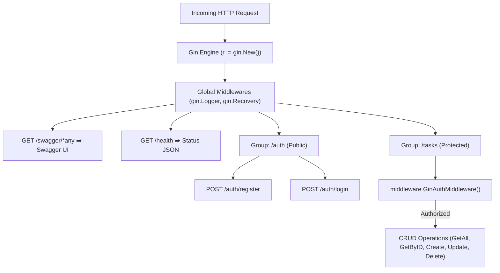

# Walkthrough 8: Modern Web Frameworks (Gin Framework) & Swagger Interactive UI

ในส่วนนี้เป็นการยกระดับ **Task Management REST API** สู่มาตรฐาน Framework ยอดนิยมระดับโลกอย่าง **Gin Framework (`github.com/gin-gonic/gin`)** พร้อมสร้างเอกสาร API แบบ Interactive ด้วย **Swagger / OpenAPI Documentation (`swaggo/swag`)** ที่สามารถเปิดทดสอบได้โดยตรงผ่านเว็บเบราว์เซอร์ 🏎️📖✨

---

## 🏗️ โครงสร้างไฟล์ที่พัฒนาในส่วนนี้

```
1_task-app/
├── docs/                      # [NEW] Swagger Documentation Files (docs.go, swagger.json, swagger.yaml)
├── middleware/
│   └── gin_auth.go            # [NEW] Gin Authentication Middleware (Bearer Token & Context Set)
├── handlers/
│   ├── auth_handler.go        # [UPDATE] Gin Context (*gin.Context) + Swagger Tags
│   ├── task_handler.go        # [UPDATE] Gin Context (*gin.Context) + Swagger Tags
│   └── task_handler_test.go   # [UPDATE] ปรับปรุง Unit Tests ให้ทดสอบผ่าน Gin Engine
├── main.go                    # [UPDATE] Gin Router, Route Groups, Swagger Endpoint (/swagger/index.html)
└── go.mod                     # [UPDATE] เพิ่ม Gin, Swagger, Swag Packages
```

---

## 🔍 8.1 สถาปัตยกรรม Gin Framework & Route Groups



---

## ⚡ 8.2 จุดเด่นของ Gin Framework + Swagger UI

### 1. Radix Tree Routing & Zero Allocation
- Gin ใช้ Radix Tree Router ที่มีความเร็วสูงสุดในบรรดา Go Web Frameworks และประหยัด Memory Allocation ได้อย่างยอดเยี่ยม

### 2. Auto JSON Binding & Context Helpers
- ใช้งาน `c.ShouldBindJSON(&input)` ช่วยตรวจและแปลง Request Body เป็น Struct ในคำสั่งเดียว
- ใช้งาน `c.Param("id")` และ `c.Query("page")` ดึงค่า Parameter ได้อย่างสะดวกและปลอดภัย

### 3. Declarative Swagger Comments (`swaggo`)
- เขียน Comment หัวฟังก์ชัน Handler ด้วยแท็ก เช่น `@Summary`, `@Tags`, `@Param`, `@Success`, `@Failure`, `@Security BearerAuth`
- รันคำสั่ง `swag init` เพื่อสร้างเอกสาร OpenAPI Specification และ Web UI อัตโนมัติ

---

## 🧪 8.3 ผลการทดสอบผ่านหน้าเว็บ Swagger UI

- **URL**: `http://localhost:8080/swagger/index.html`
- **Authentication**: รองรับปุ่ม **Authorize 🔒** กรอก `Bearer <JWT_TOKEN>` เพื่อปลดล็อก Protected Endpoints ทั้งหมด
- **Response**: ตอบกลับสถานะ `200 OK` พร้อมข้อมูล Tasks, Pagination Metadata, และ Response Headers ในรูปแบบ JSON สวยงามบนเว็บเบราว์เซอร์ 🌐

```json
{
  "data": [
    {
      "id": 13,
      "title": "title 0003xxx",
      "description": "desc 0003xx",
      "completed": true,
      "user_id": 1,
      "created_at": "2026-08-17T03:02:10.179468Z"
    },
    {
      "id": 12,
      "title": "test 001",
      "description": "desc 001",
      "completed": false,
      "user_id": 1,
      "created_at": "2026-08-17T03:01:58.312585Z"
    }
  ],
  "page": 1,
  "limit": 10,
  "total_items": 2,
  "total_pages": 1
}
```

---

## 🧠 สรุป Concept สำคัญของ Section นี้

| หัวข้อ | Concept ในภาษา Go & Gin Framework |
| :--- | :--- |
| **Gin Engine** | การกำหนด Mode (`gin.ReleaseMode`), Engine (`gin.New()`), และ Middlewares |
| **Route Grouping** | การจัดกลุ่ม URL Path และกำหนด Middleware เฉพาะกลุ่ม เช่น `r.Group("/tasks", GinAuthMiddleware())` |
| **`*gin.Context`** | การอ่านค่า Param, Query, Header, JSON Body และการส่งคำตอบ `c.JSON()` |
| **Swagger / OpenAPI** | การสร้าง Interactive API Documentation อัตโนมัติด้วยคำสั่ง `swag init` |
| **JWT Bearer in Swagger** | การตั้งค่า `@securityDefinitions.apikey BearerAuth` เพื่อทดสอบระบบ Auth บนหน้าเว็บ |
