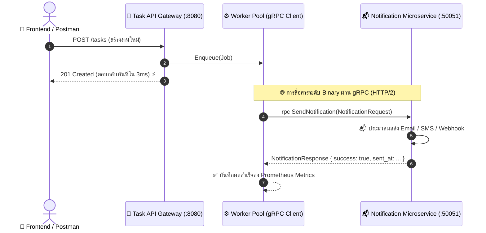

# Walkthrough 10: Microservices Architecture with gRPC & Protocol Buffers

ในส่วนนี้เป็นการยกระดับสถาปัตยกรรมสู่ระบบ **Distributed Microservices** โดยแยกการทำงานออกเป็น 2 Services อิสระ และเชื่อมต่อการสื่อสารข้ามเครือข่ายด้วย **gRPC บน HTTP/2 Binary Protocol** และนิยาม Data Contract ด้วย **Protocol Buffers (Protobuf)** 🌐🚀⚡

---

## 🏗️ โครงสร้างไฟล์ที่พัฒนาในส่วนนี้

```
1_task-app/
├── proto/
│   ├── notification.proto                     # [NEW] สัญญาข้อตกลง Data Contract (Protobuf)
│   └── notification/
│       ├── notification.pb.go                 # [NEW] Go Protobuf Message Structs
│       └── notification_grpc.pb.go            # [NEW] Go gRPC Client & Server Interfaces
├── cmd/
│   └── notification-service/
│       └── main.go                            # [NEW] Notification Microservice Server (:50051)
├── workers/
│   └── worker_pool.go                         # [UPDATE] ทำหน้าที่เป็น gRPC Client ยิง RPC Call ข้าม Service
├── main.go                                    # [UPDATE] ส่ง gRPC Service Address เข้า WorkerPool
└── README.md                                  # [UPDATE] เอกสารประกอบโปรเจกต์ฉบับสมบูรณ์
```

---

## 🔍 10.1 สถาปัตยกรรม Microservices & gRPC Communication



### 📋 สรุปลำดับการทำงาน (Cross-Service Lifecycle):

| ขั้นตอน | ส่วนประกอบ | สิ่งที่เกิดขึ้น |
| :---: | :--- | :--- |
| **1** | **Client Request** | ผู้ใช้ส่ง `POST /tasks` หรือ `PUT /tasks/{id}` มาที่ Gateway |
| **2** | **Task API Gateway** | บันทึกข้อมูลลง PostgreSQL / Redis แล้วตอบกลับ 201 Created ทันที (ไม่บล็อก Client) |
| **3** | **Worker Pool Enqueue** | ส่ง Job เข้า Buffered Channel ภายใน RAM ของ Task API |
| **4** | **gRPC Remote Procedure Call** | Background Worker เรียกคำสั่ง `SendNotification` ผ่าน gRPC Binary Protocol ไปยังพอร์ต `:50051` |
| **5** | **Notification Microservice** | รับ Binary Request ➡️ ประมวลผลส่งแจ้งเตือน ➡️ ส่ง Binary Response กลับมา |

---

## ⚡ 10.2 จุดเด่นของ gRPC & Protocol Buffers

### 1. High Performance & Binary Serialization
- ข้อมูลถูกเข้ารหัสและส่งในรูปแบบ **Binary Stream** ขนาดเล็กกว่า JSON 5–10 เท่า ประหยัด Bandwidth และ CPU Serialization Time มหาศาล

### 2. Contract-First & Strict Type Safety
- ทั้งสอง Services สื่อสารกันผ่าน Data Contract เดียวกัน (`proto/notification.proto`) ป้องกันปัญหา Schema Mismatch ตั้งแต่ตอน Compile Time

### 3. HTTP/2 Multiplexing
- สามารถส่งหลายๆ RPC Calls พร้อมกันใน TCP Connection เดียวกันได้โดยไม่เกิดปัญหา Head-of-line Blocking

---

## 🧪 10.3 ผลการทดสอบจริง (Cross-Service Live Execution)

จากการรันแยก 2 Services บนเครื่องจริง:

### 1. หน้าต่าง Notification Microservice (`:50051`):
```text
==================================================
📬 Notification Microservice (gRPC) listening on port :50051
==================================================
2026/08/19 09:21:27 📬 [gRPC Server] RECEIVED: Event='TASK_CREATED' | TaskID=15 | UserID=1 | Title='test 3'
2026/08/19 09:22:08 📬 [gRPC Server] RECEIVED: Event='TASK_UPDATED' | TaskID=15 | UserID=1 | Title='test change 333'
```

### 2. หน้าต่าง Task API Gateway (`:8080`):
- ยิง `POST /tasks` และ `PUT /tasks/15` ผ่าน Swagger UI / Postman
- Background Worker จัดการยิง RPC ข้าม Service ได้สำเร็จ 100% ในระดับเสี้ยววินาที! 🚀

---

## 🧠 สรุป Concept สำคัญของ Section นี้

| หัวข้อ | Concept ในภาษา Go & Distributed Systems |
| :--- | :--- |
| **Protocol Buffers** | การนิยาม `service` และ `message` ด้วยไวยากรณ์ `proto3` |
| **gRPC Server** | การสร้าง `grpc.NewServer()`, การ Implement Interface และการจัดการ Graceful Stop |
| **gRPC Client** | การใช้ `grpc.NewClient()` เชื่อมต่อไปยัง Target Service ด้วย Insecure / TLS Credentials |
| **Microservices Decoupling** | การแยก Business Logic งานหนัก (Notification/Mailer) ออกจาก API Gateway หลัก |
