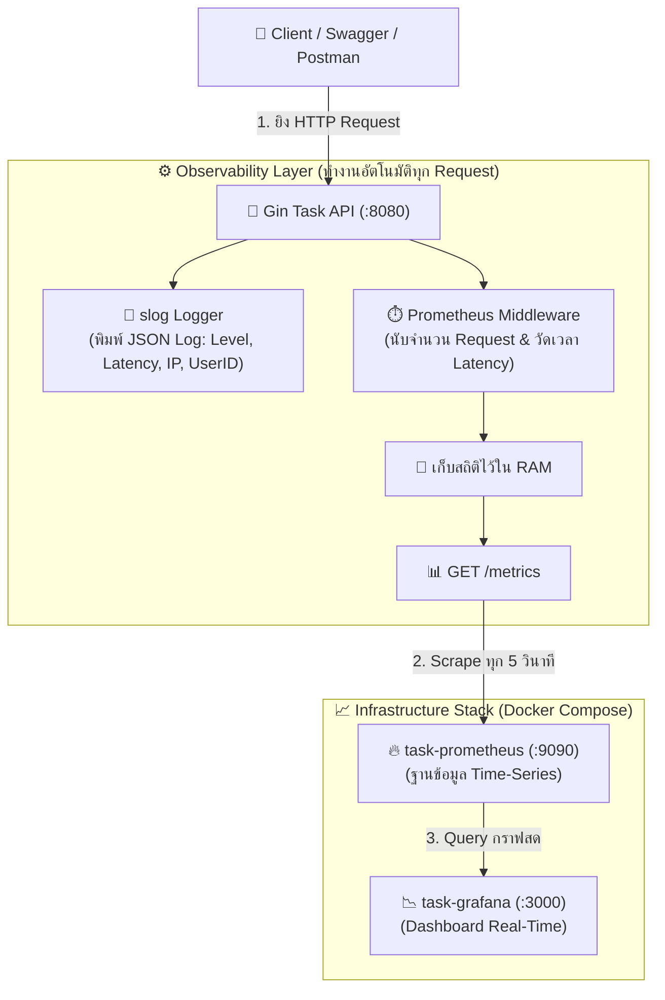

# Walkthrough 9: Observability with Structured Logging (`slog`), Prometheus & Grafana

ในส่วนนี้เป็นการยกระดับ **Task Management REST API** สู่มาตรฐานการเฝ้าระวังระบบ (System Observability & Monitoring) ระดับ Production โดยนำ **`log/slog` (Structured JSON Logging)**, **Prometheus (Metrics Collection)** และ **Grafana (Real-Time Visual Dashboards)** มาทำงานร่วมกันอย่างสมบูรณ์แบบ 📊📈🔍

---

## 🏗️ โครงสร้างไฟล์ที่พัฒนาในส่วนนี้

```
1_task-app/
├── metrics/
│   └── metrics.go             # [NEW] Prometheus Metrics Collector (Counter, Histogram, Middleware)
├── middleware/
│   └── slog_logger.go         # [NEW] Structured JSON Logger Middleware ด้วย log/slog
├── prometheus.yml             # [NEW] ไฟล์คอนฟิกการ Scrape Metrics ทุกๆ 5 วินาที
├── docker-compose.yml         # [UPDATE] เพิ่ม Prometheus (:9090) และ Grafana (:3000)
├── workers/
│   └── worker_pool.go         # [UPDATE] บันทึกสถิติ Worker Jobs สำเร็จเข้า Prometheus
├── main.go                    # [UPDATE] สวม Observability Middlewares และเปิด Endpoint /metrics
└── README.md                  # [UPDATE] เอกสารประกอบโปรเจกต์ฉบับสมบูรณ์
```

---

## 🔍 9.1 สถาปัตยกรรม Observability Pipeline (เข้าใจง่ายใน 3 ขั้นตอน)



### 📋 สรุปลำดับการทำงาน (Request Lifecycle):

| ขั้นตอน | ส่วนประกอบ | สิ่งที่เกิดขึ้น |
| :---: | :--- | :--- |
| **1** | **Client Request** | ผู้ใช้ส่ง Request มาที่ API เช่น `GET /tasks` หรือ `POST /tasks` |
| **2** | **Structured Logging (`slog`)** | พิมพ์ Log รูปแบบ JSON ทันที พร้อมบอก Method, Path, Status, Latency และ UserID |
| **3** | **Metrics Collection** | Middleware บันทึกตัวเลขสถิติ (จำนวนครั้ง + เวลาประมวลผล) เก็บไว้ใน RAM |
| **4** | **Prometheus Scrape** | Prometheus Server แวะมาดึงข้อมูลจาก `GET /metrics` ทุกๆ 5 วินาที เพื่อบันทึกลง Time-Series DB |
| **5** | **Grafana Dashboard** | Grafana ยิง PromQL ไปดึงข้อมูลมาวาดเป็นกราฟเส้น Real-Time บนหน้าเว็บ |

---

## ⚡ 9.2 จุดเด่นของระบบ Observability

### 1. Structured JSON Logging (`log/slog`)
- มาตรฐานใหม่ของ Go 1.21+ ทำงานเร็วระดับ Native
- บันทึก Log ทุก Request ในรูปแบบ JSON เหมาะสำหรับการนำไปประมวลผลต่อด้วย Log Aggregators (เช่น Loki, Datadog, Elasticsearch):
```json
{
  "time": "2026-08-19T08:35:12.450Z",
  "level": "INFO",
  "msg": "HTTP Request Completed",
  "method": "GET",
  "path": "/tasks",
  "query": "completed=false",
  "status": 200,
  "ip": "127.0.0.1",
  "latency": "1.74ms",
  "user_id": 1
}
```

### 2. Prometheus Metrics Collector
- **`http_requests_total`**: Counter ติดตามปริมาณ Request ทั้งหมด แยกตาม Method, Path และ Status Code
- **`http_request_duration_seconds`**: Histogram วัดการกระจายตัวของ Latency (Buckets: 500µs ถึง 2.5s)
- **`task_worker_jobs_total`**: Counter ติดตามจำนวนงานที่ Background Worker ทำเสร็จ

### 3. Grafana Real-Time Dashboard
- แสดงผลกราฟ Time Series แบบสดๆ ผ่านหน้าเว็บ `http://localhost:3000`
- สามารถวิเคราะห์ปัญหา Traffic Spikes, Error Rates (4xx, 5xx), และ Performance Bottlenecks ได้ทันที!

---

## 🧪 9.3 ผลการทดสอบจริง (Dashboard Visualization)

จากผลการทดสอบจริงในหน้าจอ Grafana:
- **`GET /metrics`**: เส้นกราฟสีน้ำเงินพุ่งขึ้นอย่างต่อเนื่องตามรอบการ Scrape ทุก 5 วินาทีของ Prometheus
- **`POST /auth/login` & `GET /tasks`**: เส้นกราฟแสดง Request จริงที่ถูกยิงเข้ามาจาก Client
- **`GET /favicon.ico` (404)**: แสดงจุดสีเหลืองแจ้งเตือน Client Error อย่างชัดเจน

---

## 🧠 สรุป Concept สำคัญของ Section นี้

| หัวข้อ | Concept ในภาษา Go & Cloud-Native |
| :--- | :--- |
| **`log/slog`** | การสร้าง Structured Logger ด้วย `slog.NewJSONHandler` และการแนบ Key-Value Attributes |
| **Prometheus Exporter** | การใช้งาน `promauto.NewCounterVec`, `NewHistogramVec` และ `promhttp.Handler()` |
| **Scrape Configuration** | การตั้งค่า `scrape_interval: 5s` และ `host.docker.internal` ใน `prometheus.yml` |
| **PromQL (Query Language)** | คำสั่งวิเคราะห์ข้อมูล เช่น `rate()`, `sum by ()`, และ `histogram_quantile()` |
| **Grafana Dashboards** | การสร้าง Time Series Visualization และการตั้ง Auto Refresh ทุก 5 วินาที |
